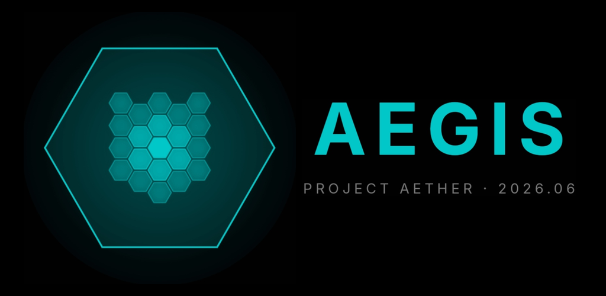
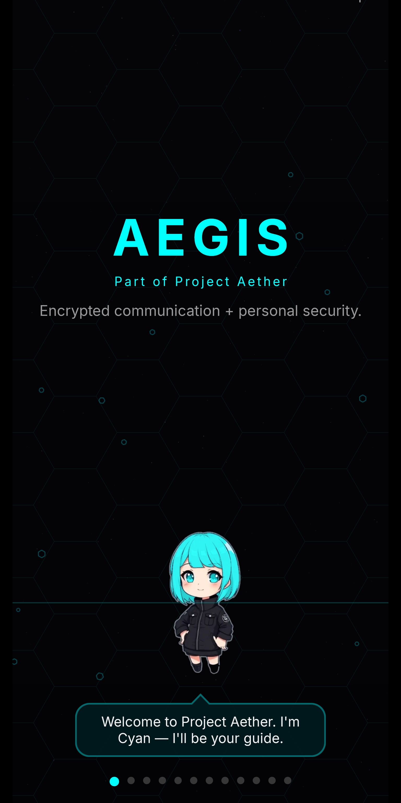
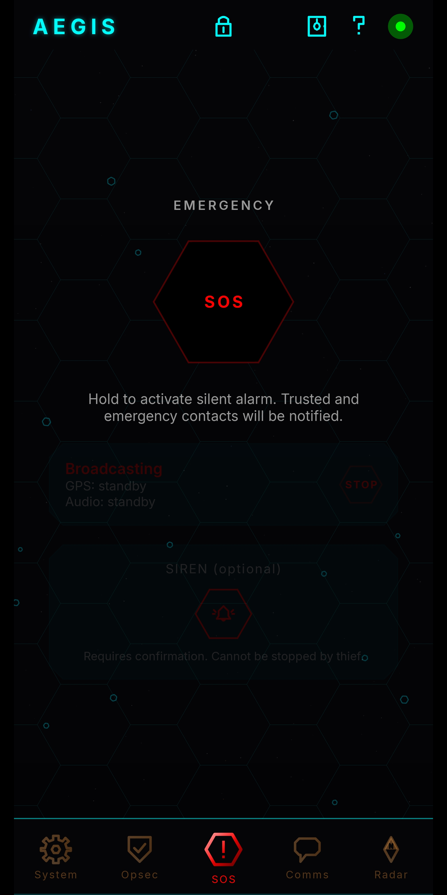
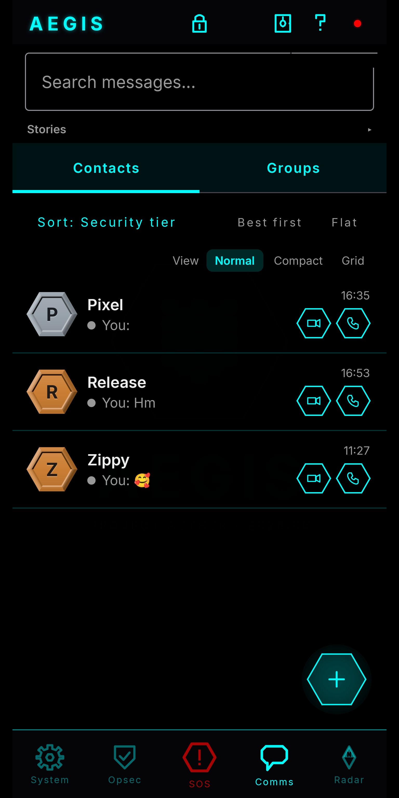

<h1 align="center">Aegis</h1>

<p align="center">
  <strong>Encrypted communication. Emergency response. Personal security.</strong>
</p>

<p align="center">
  <em>Part of Project Aether</em>
</p>

<p align="center">
  
  
  
  
</p>

<p align="center">
  
</p>

<p align="center">
  
  
  
</p>

---

## Install

Download the latest APK from [Releases](https://github.com/artst3in/Aegis/releases). Android 10+. GrapheneOS recommended.

The app self-updates from this repository.

---

## What Is Aegis

A personal security app built around one principle: if someone you protect is in danger, everyone in their circle knows immediately — location, audio, camera — and can act remotely.

All messaging runs through SimpleX. No accounts, no phone numbers, no metadata, no central server. Your real identity never enters the transport — every connection uses a fresh anonymous handle.

---

## ⚠️ Alpha

Aegis is in active development. See [SECURITY_STATUS.md](SECURITY_STATUS.md) for what works, what doesn't, and what you should not trust yet.

Working: E2E messaging, SOS, duress profiles, Aegis Protocol, Sentinel, skill tree, vault, radar, 24-word recovery, transactional delivery, receipt reconciliation, remote siren/lock, glass effects.

In debugging: calls, backup, remote locate/wipe, full panic coordination.

**Do not rely on it for life-critical situations until the security status says otherwise.**

---

## Core Features

### SOS

One-second hold or power button ×4 from any state — lock screen, pocket, screen off. Broadcasts GPS, audio, and camera to all trusted contacts. Siren overrides silent mode. Voyager mode fakes a dead battery while GPS continues transmitting for days.

### Duress

Three PINs. One real, two decoy. A duress PIN opens a fake profile with decoy contacts — cryptographically indistinguishable on disk — while silently alerting your real contacts with your location. Every PIN field in the remote access flow is a coercion trap.

### Aegis Protocol

Your identity never enters the network. Every SimpleX connection uses a fresh anonymous handle. Your name, face, and bio exist only in an encrypted overlay delivered to contacts you choose to trust. Non-incognito code was deleted from the binary, not disabled.

### Transactional Delivery

Messages exist in SimpleX for milliseconds — received, moved to RAM, deleted, sealed into the Aegis encrypted database. Transport copy destroyed after seal succeeds.

| Symbol | Meaning |
|--------|---------|
| 🕐 | Pending — in outbox |
| ✓ dim | Sent |
| ✓✓ dim | Delivered |
| ✓ bright + ✓ dim | Sealed at rest |
| ✓✓ bright | Read |

Receipt reconciliation heals dropped ticks across lossy links — zero extra traffic.

### 24-Word Recovery Phrase

BIP39 master key for everything. Shown once. Never stored, never transmitted, never recoverable. Lost the phrase and the PIN? Gone forever. That is the design.

### Trust Model

| Tier | What they get |
|------|--------------|
| **Trusted** | Everything — location, presence, SOS, remote access |
| **Emergency** | SOS alerts only |
| **Untrusted** | Messages only |

### Sentinel

Covert intrusion detection. Three-sensor cascade: ultrasonic sonar → proximity → accelerometer. Detects someone approaching or picking up the phone. Camera captures, forensic motion model, silent notification to trusted contacts. Patent filed.

### Remote Access

Trusted contacts can locate, lock, ring, or wipe your phone. Wipe requires typed "WIPE" + target's PIN. Every PIN prompt in the remote flow accepts duress PINs — instant session revoke + silent SOS.

### More

Encrypted vault with separate PIN. Anonymous groups. Radar (live contact map). Mugshot on wrong PIN. SIM swap alerts. Canary (dead man's switch). Geofence alerts. Crash detection. Ephemeral profiles (RAM-only, zero forensic trace). Lock curtain (two-finger drag). Disappearing messages. 16 languages.

---

## Architecture

```
Messaging · SOS · Sentinel · Remote Access · Trust Model
                      |
        Transactional Delivery (SimpleX)
        Sealed into DB. Transport destroyed.
                      |
Loki: Mugshot · SIM Watch · Canary · Geofence
Security: 24-Word Phrase · Vault · Duress
Protocol: Identity never enters transport
```

298 Kotlin files. 88,559 lines. Jetpack Compose. Android 10+.

---

## Origins

Every feature has a documented origin — the military, intelligence, industrial, or scientific precedent that inspired it. 25 entries from Voyager to No Country for Old Men. Accessible in-app.

---

## Project Aether

| Component | Role | Repository |
|-----------|------|------------|
| **LunaOS** | Brain | Coming soon |
| **Aegis** | Shield | [artst3in/Aegis](https://github.com/artst3in/Aegis) |
| **LunaGlass** | Design | [artst3in/LunaGlass](https://github.com/artst3in/LunaGlass) |

---

## Privacy

No accounts. No phone numbers. No servers you don't control. No metadata. No analytics. No tracking. No advertising. Your identity never enters the transport.

---

## License

**AGPL-3.0** — see [LICENSE](LICENSE). Incorporates [SimpleX Chat](https://simplex.chat/) (AGPL-3.0). See [ATTRIBUTION](ATTRIBUTION-SimpleX.md).

---

<div align="center">

🛡️

</div>
